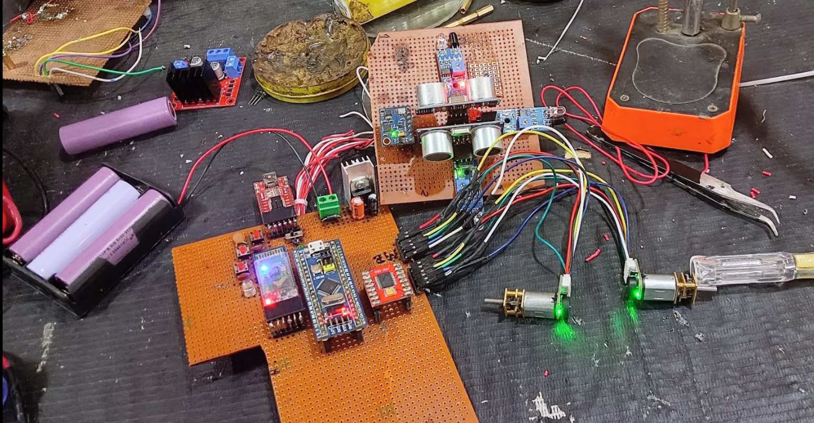

# Micromouse Bot

A wall-following maze robot that went through several hardware iterations but was never fully completed. This repo documents both: the working DIY/makeshift Arduino Mega build (code included below) and an earlier, more ambitious STM32-based perfboard build that never got a finished maze-solving algorithm.

<p align="center">
  
</p>

*(disassembled view of the wiring — video demo to be added)*

## Hardware

- Arduino Mega 2560
- 4x IR sensors (left, front-left, front-right, right) for wall detection
- 2x ultrasonic sensors (left, right) for wall-distance PID centering
- 2x encoded N20 gear motors for closed-loop turning
- Jumper-wire wiring — no custom PCB, built to be quick to iterate on

## How it works

- The 4 IR sensors classify walls as present/absent on the left, front, and right
- If a front wall is detected: check left/right IR to pick a direction — turn around if boxed in on both sides, otherwise turn toward whichever side is open
- If there's no front wall: drive forward using a PID loop over the two ultrasonic readings to stay centered between the left and right walls (`Kp = 3.0, Ki = 0.0, Kd = 1.2`)
- Turns are executed using encoder pulse counts (converted from wheel diameter + wheelbase geometry) rather than fixed time delays, for more consistent 90°/180° turns

## Status

Never fully completed — this is a working snapshot of reactive wall-following, not a finished maze-mapping/solving competition bot.

## Other iteration: STM32 BluePill build (also unfinished)

Before the Mega version above, this went through a much more ambitious build:

- STM32 BluePill, flashed via an FTDI module
- TB6612FNG motor driver, 2x encoded N20 motors
- Bluetooth module for phone control + live telemetry
- MPU6050 IMU
- 2x ultrasonic sensors, 3x IR sensors
- An OLED screen for live status, plus buttons/LEDs to switch between modes
- All hand-wired on a single perfboard

<p align="center">
  
</p>

Every subsystem — motors, the Bluetooth link, IMU, OLED, sensors — worked individually and together after testing. What never got finished was a complete maze-solving algorithm on top of it; a proper flood-fill/maze-mapping implementation turned out to be a bigger scope than made sense to take on at the time. The project was shelved there, and the code for it wasn't kept.

Including it here anyway — the hardware integration work was real, even though the algorithm side never got finished.

## Code

- [`wall_follow_mega.ino`](wall_follow_mega.ino) — the Arduino Mega build above (no code survives for the STM32 build)

## What I'd improve

- Add actual maze-mapping/solving (flood-fill or similar) — currently it only reacts to walls in front of it, it doesn't remember the maze
- Tune in the `Ki` term (currently 0) if steady-state centering drift shows up on longer straights
- Move off jumper-wire wiring to a proper perfboard/PCB for reliability

## Repo structure

```
micromouse-bot/
├── README.md
├── wall_follow_mega.ino
├── build.jpg
└── perfboard-build.jpg
```
